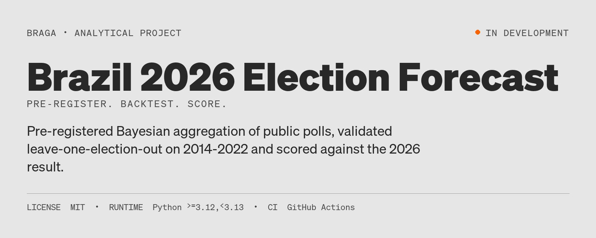
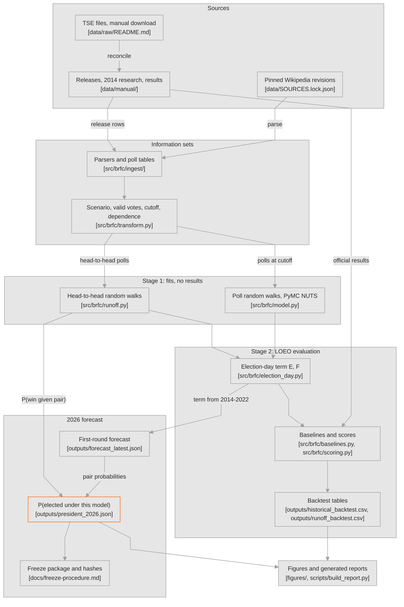

# Brazil 2026 Election Forecast



[](https://github.com/RafaelBraga-Kribitz/brazil-2026-election-forecast/actions/workflows/ci.yml)
[](pyproject.toml)
[](LICENSE)
[](#status)


**Status:** In development

How accurate and how well calibrated is a pre-registered Bayesian aggregation of public polls, compared with simple poll averages and public benchmarks, when every forecast uses only information available at the time? The question matters to anyone who reads poll-based election forecasts; the 2026 Brazilian presidential election is the live test, after a leave-one-election-out backtest on 2014, 2018 and 2022.

## Decision summary

**Decision rule.** The forecast frozen on Saturday 2026-10-03 at 22:00 BRT (2026-10-04T01:00:00Z) is scored against the official TSE results and published whatever the result. Frozen files are never rewritten; corrections go into dated addenda.

**Current forecast: PRELIMINARY (cutoff 2026-09-29), not the frozen forecast.** Under this model, Lula has a 50.5% probability of being elected: 10.7% from an outright first-round win and 39.9% via the runoff pair Flávio Bolsonaro vs Lula (parts rounded separately). For Flávio Bolsonaro the figure is 49.5%: 4.3% outright and 45.2% via that pair. The pair has an 85.0% probability; pairs without a head-to-head fit have 0.0%. Neither probability is far from 50%, and the difference between them is smaller than the spread across the reported model combinations: Lula's probability ranges from 41.6% (F × E0, diagnostic) to 55.8% (F × F), and Flávio Bolsonaro's from 44.2% to 58.4%. In the runoff pair, the median valid-vote shares are 50.3% for Flávio Bolsonaro and 49.7% for Lula; the 80% equal-tailed posterior predictive intervals are 45.5% to 55.1% and 44.9% to 54.5%, and both contain 50%.

**Historical evidence.** In the leave-one-election-out backtest at the eve horizon (6 rounds, 2014-2022), the primary model F had a share error of 1.38 pp, against 2.07 pp for a 14-day poll average (baseline B). Of its 21 eve categories, 19 (90%) fell inside its 94% equal-tailed posterior predictive intervals; in the first round alone it was 13 of 15. The 21 are not independent checks: 6 are the two complementary shares of the 3 runoffs, and categories within an election are correlated. Two more misses would have failed criterion H2. Its first-place probabilities scored worse than baseline B's (Brier 0.075 vs 0.034), so pre-registered criterion H3 is **not met**. At earlier first-round cutoffs its intervals were too narrow, and its first-place Brier was worse than B's and E's at every first-round horizon (see [Limitations](#limitations)). For who was elected, the conditional forecast scored a Brier of 0.109 against 0.115 for baseline B; with error-scale prior 6 it scores 0.128, so that comparison depends on a prior choice. Three elections are weak evidence, and one live election cannot establish skill.

![Two-panel chart. Left: horizontal bars of the probability of being elected under this model for Lula (50.5%) and Flávio Bolsonaro (49.5%), split into an outright first-round win segment and a segment via their runoff pair, plus an empty bar for unmodelled pairs (0.0%). Right: the runoff valid-vote share of Flávio Bolsonaro, the first-listed candidate of the pair with Lula (Lula's share is the complement), with 80% and 94% equal-tailed posterior predictive intervals around a median of 50.3%, next to a dashed 50% line; the pair has an 85% probability. CALIBRATED, preliminary.](figures/president_probability.png)

*Each probability is mostly a runoff probability, and that runoff interval straddles 50%. These PRELIMINARY numbers change at the FINAL freeze. Source: `outputs/president_2026.json`.*

## Explore this project

| Audience | Start here |
|---|---|
| Recruiter (2 min) | [Decision summary](#decision-summary) · [primary chart](figures/president_probability.png) |
| Hiring manager (10 min) | [Results](#results-6-historical-rounds-and-the-2026-forecast) · [Method](#method) · [Limitations](#limitations) |
| Technical reviewer | [Architecture](#architecture) · [Reproduce](#reproduce) · [methodology](docs/methodology.md) |
| Auditor | [Data](#data) · [Validation](#validation) · [pre-registration](PREREG.md) · [freeze procedure](docs/freeze-procedure.md) |

## Results: 6 historical rounds and the 2026 forecast

Every backtest forecast below uses only polls available at its cutoff. The election-day term and every baseline's error band for an election are learned from the other elections only (leave-one-election-out, LOEO). Baselines B, C and D published no probabilities. Their coverage and Brier scores use a *calibrated probabilistic conversion*: point + Normal(0, LOEO RMSE). Full tables: [`docs/historical-backtest.md`](docs/historical-backtest.md) and [`docs/runoff-backtest.md`](docs/runoff-backtest.md).

### First round at the eve horizon (2014, 2018, 2022)

| Model | Share MAE (pp) | Top-two margin abs. error (pp) | First-place Brier | 80% coverage | 94% coverage | Runoff-round share MAE (pp) | Runoff-round winner Brier |
|---|---|---|---|---|---|---|---|
| F: random walk + election-day term (primary) | **2.33** | 7.61 | 0.084 | 80% | 87% | 0.42 | 0.066 |
| E: random walk, zero-mean day error | 2.67 | 5.09 | 0.019 | 87% | 93% | 0.57 | 0.021 |
| E0: random walk only (diagnostic) | 2.58 | 5.12 | 0.000 | 27% | 40% | 0.57 | 0.000 |
| B: latest poll per pollster, 14 days | 3.19 | 6.13 | 0.017 | 73% | 93% | 0.96 | 0.052 |
| C: final Datafolha poll | 3.32 | 6.88 | 0.000 | 73% | 87% | 0.76 | 0.000 |
| D: final AtlasIntel poll (2022 only) | 1.41 | 3.98 | N/A | N/A | N/A | 2.51 | N/A |

Three first rounds per row (D: one), 15 candidate categories for coverage. The two runoff-round columns are the post-first-round forecast of the second round at the eve horizon, over three rounds (D: one, 2022). Sources: `outputs/backtest_summary.csv`, `outputs/calibration.csv`. In the runoff round F has the lowest share error but a worse winner Brier than B and E (0.066 vs 0.052 and 0.021), mostly from 2022 (F 0.190, B 0.146, E 0.059; `outputs/historical_backtest.csv`). F is the registered primary model for the post-first-round runoff forecast. In the first round F has the lowest share error of the models scored on all three rounds. It also has the **largest** top-two margin error and the **worst** first-place Brier. E0's intervals are far too narrow (40% coverage at 94%), so its near-zero Brier comes from confident forecasts that put first place right in all three rounds. D covers one election and was chosen for its past record, so read it with winner's-curse caution.

![Two line panels of mean absolute share error in percentage points against forecast horizon, one line per model, with the number of rounds averaged printed under each horizon. Left, first round from T-30 to eve: F, E and B start between 6.9 and 7.3 pp at T-30 (2 rounds), C starts at 6.0 pp at T-14, and the lines end at the eve at 2.3 (F), 2.7 (E), 3.2 (B) and 3.3 (C) pp. Right, runoff from T-14 (1 round) to eve: every line rises from T-14 to T-7, stays at or below 2.5 pp, and ends between 0.4 (F) and 1.0 (B) pp; D appears only as one T-14 point at 1.5 pp. CALIBRATED forecasts scored against VERIFIED results.](figures/historical_backtest.png)

*In both panels every line ends lower at the eve than at its earliest horizon, but not every step is lower: F's first-round error is flat from T-14 to T-7 (4.77 and 4.79 pp), and every runoff line rises from T-14 to T-7. Each point averages one to three rounds, and the set of rounds changes along the axis (runoff T-14 is 2022 only), so one more election could reorder the models.*

### Pre-registered criteria

| Criterion (eve horizon) | Value | Met |
|---|---|---|
| H1: F share MAE <= B, 6 rounds | F 1.38 vs B 2.07 pp | yes |
| H2: F 94% coverage in [85, 100]%, 80% in [65, 95]% | 94%: 90% (19 of 21), 80%: 86% (18 of 21) | yes |
| H3: F first-place Brier <= B conversion | F 0.075 vs B 0.034 | **no** |
| H4: F share MAE <= E | F 1.38 vs E 1.62 pp | yes |
| HR1: head-to-head E share MAE <= B | E 3.27 vs B 3.74 pp (3 elections) | yes |
| HR2: runoff share inside E's 94% interval in >= 2 of 3 | 3 of 3 | yes |
| HR3: "who was elected" Brier, F × E <= B | F × E 0.109 vs B 0.115 (3 elections) | yes |

Sources: `outputs/success_criteria_historical.json`, `outputs/success_criteria_runoff.json`. H1-H4 pool both rounds. H2 rests on 21 correlated categories, and HR1-HR3 on three elections. The H3 miss comes mostly from 2022: F's first-place Brier was 0.250 in the first round, against 0.049 for B (`outputs/historical_backtest.csv`). Model E, without the mean term, scored 0.057 there. The mean term improves share error, but in 2022 it moved probability toward second place in an election where the polls had first place right.

### Who was elected: conditional backtest (first-round eve and T-7 cutoffs)

The conditional forecast combines first-round pair probabilities with head-to-head polls fielded before the first round (pre-registered in Addendum 04). Values are the probability given to the candidate who was elected. Sources: `outputs/president_backtest.csv`, `outputs/runoff_sensitivity.csv`.

| Election (candidate elected) | F × E (primary) | E × E | F × F | B (conversion) | C (conversion) |
|---|---|---|---|---|---|
| 2014 (Dilma Rousseff) | 0.884 | 0.863 | 0.869 | 0.862 | 0.761 |
| 2018 (Jair Bolsonaro) | 0.632 | 0.629 | 0.410 | 0.604 | 0.583 |
| 2022 (Lula) | 0.874 | 0.905 | 0.852 | 0.956 | 0.999 |
| Mean Brier, eve cutoff | 0.109 | 0.107 | 0.257 | 0.115 | 0.142 |
| Mean Brier, T-7 cutoff | 0.356 | 0.360 | 0.210 | 0.366 | 0.375 |

The primary combination is not uniformly better. E × E scored slightly better at the eve cutoff. F × F scored better at T-7 and much worse at the eve. At T-7 in 2018 the primary combination gave the elected candidate 0.352. For the head-to-head share alone, the latent-only model E0 had a lower eve Brier (0.078) than E (0.118), but its 94% interval missed the 2022 runoff result.

### 2026 PRELIMINARY forecast (cutoff 2026-09-29)

**PRELIMINARY; pre-registered; validated on 3 elections only.** First round, model F, valid votes. Fitted on 57 polls from 17 pollsters (Wikipedia PT revision 73082572). Intervals are 80% and 94% equal-tailed posterior predictive intervals.

| Candidate | Median (%) | 80% interval | 94% interval | P(first place) | P(above 50%) | Baseline B point, same cutoff (%) |
|---|---|---|---|---|---|---|
| Lula | 45.7 | 41.0 to 50.1 | 38.9 to 52.3 | 64.3% | 10.7% | 44.0 |
| Flávio Bolsonaro | 43.9 | 39.4 to 48.4 | 37.0 to 50.4 | 35.8% | 4.3% | 41.5 |
| Augusto Cury | 3.3 | 0.0 to 8.1 | 0.0 to 10.2 | 0.0% | 0.0% | 4.9 |
| Renan Santos | 2.6 | 0.0 to 6.1 | 0.0 to 7.8 | 0.0% | 0.0% | 4.1 |
| Ronaldo Caiado | 2.4 | 0.0 to 5.8 | 0.0 to 7.3 | 0.0% | 0.0% | 3.6 |
| Others | 0.4 | 0.0 to 4.3 | 0.0 to 6.1 | N/A | N/A | 1.8 |

Sources: `outputs/forecast_latest.json`, `outputs/baseline_comparison_2026.csv`; percentages are rounded separately. The median for "Others" (0.4%) is well below its polling consensus (1.8% under model E0). This is an artefact of the additive role shift described under [Limitations](#limitations).

Model F adds its election-day role means by forecast rank, not by candidate: +0.67 pp to rank 1 (Lula), +2.78 pp to rank 2 (Flávio Bolsonaro) and −1.31 pp to each other category (`outputs/forecast_latest.json`, `error_models.F`). F differs from E by this mean term, and the term is behind the H3 miss: model E, without it, scored a first-place Brier of 0.020 against B's 0.034 (both rounds pooled). Under model E, P(first place) is 77.2% for Lula and 22.8% for Flávio Bolsonaro, and P(above 50%) is 7.3% and 0.6%. Baseline B's conversion gives 62.0% and 38.0%, and 9.0% and 3.3% (`outputs/forecast_latest.json`).

Probability of being elected under this model (combination F × E; `outputs/president_2026.json`):

| Candidate | P(elected) | Outright first-round win | Via runoff Flávio Bolsonaro vs Lula | Alternative F × F | Alternative E × E | Alternative F × E0 (diagnostic) |
|---|---|---|---|---|---|---|
| Lula | 50.5% | 10.7% | 39.9% | 55.8% | 50.5% | 41.6% |
| Flávio Bolsonaro | 49.5% | 4.3% | 45.2% | 44.2% | 49.5% | 58.4% |
| Pairs without a head-to-head fit | 0.0% | | | 0.0% | 0.0% | 0.0% |

Percentages are rounded separately, so parts may not add up exactly. Five pairs had enough head-to-head polls, all including Lula. The pair Flávio Bolsonaro vs Lula (59 polls) has probability 85.0% under model F. Within that pair, P(win) is 53.1% for Flávio Bolsonaro and 46.9% for Lula. The head-to-head model tracks the first-listed candidate's share; the other share is its complement. Medians: 50.3% for Flávio Bolsonaro and 49.7% for Lula. 80% intervals: 45.5% to 55.1% and 44.9% to 54.5%. 94% intervals: 42.8% to 57.6% and 42.4% to 57.2%. F × E0 has no head-to-head election-day term. In the head-to-head backtest its 94% interval missed the 2022 runoff result, and it was not scored in the who-was-elected backtest. No baseline P(elected) was computed for 2026.


*The election-day markers are wider than the bands at the cutoff because they add the historical deviation between eve polls and results.*

## Method

1. **Input.** National stimulated vote-intention polls come from pinned Wikipedia revisions (PT primary, EN for conflicts and 2014). Final polls are checked against pollster releases. The 2014 head-to-head polls come from original releases. Official results come from TSE-citing sources and are reconciled with TSE files.
2. **Transformation.** Each poll keeps one scenario, the one closest to the registered ballot. Shares are converted to valid votes; undecided respondents are allocated proportionally, which is an assumption. An information-time filter keeps only polls with fieldwork (and, where known, publication) by the cutoff. A per-pollster dependence rule drops overlapping waves. Small candidates are pooled as "Others". All of this is computed inside each cutoff's information set.
3. **Model.** Independent Gaussian random walks on the valid share, one per series, on a daily grid. The observation model adds relative pollster house effects (sum to zero), sampling error and an estimated non-sampling error. Inference is PyMC NUTS with up to three registered attempts (PREREG section 4, Addendum 03): 4000 posterior draws after 1000 tuning steps at target_accept 0.95; then target_accept 0.99 with 2000 tuning steps; then 12000 draws after 3000 tuning steps at target_accept 0.99. Of the 17 production-variant backtest fits, 10 used the first setting, 1 the second and 6 the third; the 2026 PRELIMINARY fit used the first (`outputs/model_diagnostics.csv`, `outputs/forecast_latest.json`). An election-day term, learned leave-one-election-out from past eve deviations, is added by forecast-rank role: model F has a mean per role plus a spread, E a zero-mean spread, and E0 no term. The production volatility variant (single-regime) was selected by the pre-registered rule (`outputs/regime_selection.json`).
4. **Conditional forecast.** Pair probabilities come from the first-round draws of model F. Each pair with enough head-to-head polls gets its own random walk with the zero-mean term E. `P(X elected) = P(X outright) + Σ P(pair, no outright) × P(X wins | pair)`, with the two sets of draws treated as independent.
5. **Diagnostics.** The pre-registered criteria are R-hat ≤ 1.01, bulk and tail ESS ≥ 400 and divergences ≤ 1%, with up to three sampling attempts. The 2026 PRELIMINARY first-round fit has R-hat 1.005, minimum bulk ESS 795, minimum tail ESS 1409 and 0 divergences.
6. **Validation and decision.** A LOEO backtest compares the model against baselines B, C and D (section below). The FINAL forecast is frozen, hashed and scored against TSE results.

The binding specification is [`PREREG.md`](PREREG.md) with addenda 01-06 (for example [`PREREG_ADDENDUM_04.md`](PREREG_ADDENDUM_04.md)); the prose version is [`docs/methodology.md`](docs/methodology.md).

## Data

| Source | Period / grain | Public? | Tag |
|---|---|---|---|
| Wikipedia PT poll tables, pinned revisions (2018 oldid 73055947, 2022 oldid 73055949, 2026 oldid 73082572) | National stimulated polls before each round; one row per poll, scenario and candidate. 2026: 57 first-round polls from 17 pollsters at the 2026-09-29 cutoff | yes (CC BY-SA 4.0) | `VERIFIED` |
| Wikipedia EN, "2014 Brazilian general election" (oldid 1369923991), plus EN 2026 conflict check | 2014 first round and runoff; poll-level | yes (CC BY-SA 4.0) | `VERIFIED` |
| Pollster releases, cited by URL (`data/manual/final_poll_verification.csv`, `data/manual/research_2014/`) | Final polls of all 6 historical rounds; 29 pre-first-round 2014 head-to-head polls | yes | `VERIFIED` |
| Official results from TSE-citing secondary sources (`data/manual/results_secondary.csv`) | National votes per candidate, 6 rounds, 41 candidate rows | yes | `VERIFIED` |
| TSE "Votação nominal por município e zona", 2014, 2018, 2022 | Votes by municipality and zone, summed to national totals for reconciliation | yes (manual download, not redistributed) | `VERIFIED` |
| 2026 ballot, Wikipedia PT oldid 73078529 (`data/manual/ballot_2026.csv`) | 13 registered candidates, 1 revoked candidacy | yes | `VERIFIED` |
| Valid-vote shares, forecasts, intervals and baseline conversions (`outputs/`) | Per election, round and cutoff | yes | `CALIBRATED` |

| Tag | Meaning |
|---|---|
| `VERIFIED` | Directly supported by external or source data; no modelling assumptions beyond unit conversion and aggregation |
| `CALIBRATED` | Derived through documented assumptions anchored to real data |
| `SIMULATED` | Output of a seeded stochastic or generative procedure |
| `ILLUSTRATIVE` | Example only; not evidence |

The PollingData average and Polymarket prices are captured at the FINAL freeze as benchmarks. They are a published average and a market price, and neither is treated as ground truth. Register of sources: [`DATA_SOURCES.md`](DATA_SOURCES.md).

## Validation

- **Leave-one-election-out backtest.** 2014, 2018 and 2022, both rounds. Horizons are T-30, T-14, T-7 and eve for the first round, and T-14, T-7 and eve for the runoff. The conditional forecast is scored at the first-round eve and T-7. No forecast sees its own election's deviations or baseline errors; `tests/test_loeo.py` enforces this.
- **Leakage tests.** `tests/test_leakage.py` and `tests/test_runoff.py` check three things: forecast and fit functions accept no outcome argument, stage-1 fitting never calls the result loader, and no poll after the cutoff enters an information set. `tests/test_prereg.py` checks the registration hash.
- **Information-time perturbation test.** The test changes, adds and overlaps polls after the cutoff, then checks that the information set is byte-identical. It covers both first-round and head-to-head polls.
- **Final-poll verification.** 71/71 checkable final-poll values match the pollster release within 0.5 pp. Two final polls missing from Wikipedia were added from their releases (`outputs/final_poll_verification_check.csv`, Addendum 02).
- **2014 head-to-head research.** 271/271 checks were confirmed on re-reading the original releases (`data/manual/research_2014/verification.csv`).
- **10% spot-check.** 29 seeded-random polls: 302 of the 304 fields found match the source. The 2 conflicts are the fieldwork dates of one 2026 Veritá poll, and no share value conflicted. 12 fields were not found (`data/manual/spot_check_results.csv`).
- **TSE reconciliation.** 41/41 candidate vote counts equal the TSE files, with 0 differences (`outputs/tse_reconciliation_{2014,2018,2022}.csv`).
- **Convergence.** 17 of 17 production-variant fits meet the criteria, and 33 of 34 across both variants; the miss is a two-regime cell not used in production. All 6 head-to-head backtest fits and all 5 2026 head-to-head fits converged (`outputs/model_diagnostics.csv`, `outputs/runoff_backtest.csv`, `outputs/president_2026.json`).
- **Sensitivity** (reported, never used to pick the headline). Across 12 first-round settings (`outputs/sensitivity.csv`), F's eve share error stays below B's in all 12. F's first-place Brier stays above B's in 11 of 12. For the conditional forecast, HR3 holds with error-scale prior 1.5 (0.094 vs 0.115) but **fails** with prior 6 (0.128 vs 0.115), so it depends on a prior choice.
- **2014 post-result data revision (labelled; not the reference).** Sample sizes for 11 late 2014 first-round polls were found after the registered scores had been seen (Addendum 04 section 3). With them, the 2014 eve information set grows from 17 to 27 polls. The mean first-round eve share error moves from 2.33 to 2.29 pp for F and from 3.19 to 2.85 pp for B. F's first-place Brier moves from 0.084 to 0.080, and B's from 0.017 to 0.010 (`outputs/revision_2014_first_round.csv`). The registered values above stay the reference; the revision never feeds the headline or the 2026 election-day term.
- **Registration timeline and its limit.** In the git history the registration commit (`PREREG.md`) comes before the commit with the historical backtest results (`git log --reverse --format="%h %cI %s"`). Those are local commit times, which the author's machine sets. The first timestamp outside the author's control is GitHub's record of the first push, and that push already contained the historical backtest results; the repository was private at the time. So the repository alone cannot show that the design was fixed before the backtest ran; that rests on the local commit order. Addenda 04 and 05 reached GitHub before the runoff backtest results. This shows the addenda existed before those results were pushed, not that no head-to-head fit had been run locally. The FINAL freeze tag is to be pushed before polls open (2026-10-04, 11:00Z; [`docs/freeze-procedure.md`](docs/freeze-procedure.md)), which will give the 2026 forecast an external timestamp that precedes the result.

## Architecture

The pipeline has two stages. Stage 1 parses pinned poll tables into per-cutoff information sets and fits the random walks without ever reading results. Stage 2 evaluates them leave one election out against the official results. The same code then produces the 2026 first-round and conditional forecasts that are frozen and scored.



*Drawn manually from the repository structure on 2026-09-29; gitdiagram was not used because the repository was private when the diagram was drawn.*

## Reproduce

```bash
git clone https://github.com/RafaelBraga-Kribitz/brazil-2026-election-forecast.git
cd brazil-2026-election-forecast
uv sync --locked          # Python 3.12, locked environment (uv.lock)
make test                 # validity tests: leakage, information time, LOEO, registration hash, provenance
make readiness            # data-readiness gate; TSE reconciliation only if the manual TSE files are present
make verify               # final-poll verification and the historical error table
make backtest             # first-round and runoff-round fits, then LOEO evaluation
make runoff-backtest      # head-to-head fits and the "who was elected" evaluation
make figures              # every figure from outputs/
make reproduce            # all of the above from a clean clone, plus sensitivity, 2014 revision and 2026 forecast
```

- **Run time.** `make backtest` and `make runoff-backtest` fit every model from scratch because the fit cache (`data/cache/`) is not committed. These are the slow steps.
- **2026 forecast.** `make forecast STATUS=PRELIMINARY CUTOFF=2026-09-29` and then `make president` with the same variables rebuild the PRELIMINARY forecast from the committed poll snapshot.
- **Clean-clone test (2026-09-29/30).** A fresh clone of commit `73f92ea` ran `make reproduce` from an empty fit
  cache in about 2.5 hours with the Makefile's 6 worker processes. The 2014 revision, now part of `make reproduce`,
  took about 20 more minutes. Every committed file in `outputs/` was reproduced:
  - the first-round, runoff-round and who-was-elected backtests, the sensitivity runs and the 2014 revision are
    identical (largest absolute difference 0.0);
  - the PRELIMINARY 2026 quantiles differ by at most 2e-6 pp, because draws are stored as float32; its
    probabilities of being elected are identical;
  - the figures are byte-identical, except 10 pixels of `posterior_forecast.png`, which differ by one colour level;
  - the reparse check reproduced every value of the seven poll tables.

  The test found two defects, both fixed. The `retried` flag in `outputs/model_diagnostics.csv` missed 12 of 15
  retried fits. Two table-rebuild tests compared bytes that include the HTML hash, so they failed after a
  re-download. The TSE reconciliation was not re-run in the clone, because the TSE files are not redistributed.
- **Windows.** PyMC runs its chains one after another in a single process with the numba backend, so no C compiler is needed. Keep `.venv` inside the project directory if application control blocks DLLs in temporary folders.
- **What cannot be reproduced from the repository alone.** Raw Wikipedia HTML and the TSE result files are not redistributed. Wikipedia revisions are re-downloaded by pinned oldid. The TSE files must be downloaded manually in a browser, because TSE servers refuse scripted requests. Instructions and expected file names are in [`data/raw/README.md`](data/raw/README.md).

## Limitations

- **Weak evidence.** Three historical elections (six rounds) cannot support strong calibration claims. Coverage rests on 21 correlated categories, and the head-to-head term on three deviations. One live election cannot establish skill, whatever its score.
- **Negative findings.** Criterion H3 is not met: F's first-place Brier is worse than the 14-day poll average's (0.075 vs 0.034). F's top-two margin error is also larger in the first round (7.61 vs 6.13 pp), and its runoff-round winner Brier is worse than B's and E's (0.066 vs 0.052 and 0.021). HR3 is met with the registered prior but not with scale prior 6.
- **Longer horizons.** H1-H4 are scored at the eve only. At earlier first-round cutoffs model F's intervals were too narrow: its 94% intervals covered 12 of 15 categories at T-7, 11 of 15 at T-14 and 8 of 11 at T-30 (`outputs/calibration.csv`). Its first-place Brier was worse than B's and E's at every first-round horizon (T-7: F 0.190, B 0.073, E 0.046; T-14: 0.173, 0.062, 0.050). At T-7 its share MAE (4.79 pp) was above B's (4.54) and E's (4.48) (`outputs/backtest_summary.csv`). The PRELIMINARY 2026 forecast has a 5-day horizon, which the backtest did not score.
- **Independence assumption.** The conditional forecast treats first-round and head-to-head draws as independent. A shared polling error across both rounds is not modelled, and its effect is not estimated.
- **Unmodelled pairs.** Pairs without enough head-to-head polls are reported as unmodelled and never reallocated. The 2026 unmodelled mass is 0.0% only because every first-round draw places Lula and Flávio Bolsonaro in the top two.
- **Additive role shifts.** Model F adds a mean per forecast-rank role on the valid-share scale, which can push small categories toward 0. "Others" has a 2026 median of 0.4% under F, against 1.8% under E.
- **Data and model simplifications.** Wikipedia toplines are only partly verified. Undecided and blank/null answers are combined in most tables. The random walks are independent, house effects are relative, and the design effect is 1. Full list: [`docs/limitations.md`](docs/limitations.md).
- **Reconsider this conclusion if** the frozen 2026 forecast scores worse than baseline B on share error or top-two margin (criteria L1 and L2), or several 2026 categories fall outside model F's 94% intervals (L3). With only three historical elections behind the model, one such result would be a large share of all the evidence.

## What I would do with production data

- Use pollster microdata, or at least tables that separate undecided from blank/null answers, instead of allocating undecided respondents proportionally.
- Record a publication timestamp for every poll (for example from TSE PesqEle registrations), so that information time no longer falls back on fieldwork end dates.
- Extend the evidence base beyond three presidential elections, for example with earlier elections and state races polled by the same institutes, and pool the election-day term hierarchically.
- Replace the independent walks with a compositional (ALR/softmax) model, and model first-round and runoff errors jointly instead of assuming independence.
- Estimate pollster-specific design effects from methodology notes instead of using a design effect of 1.

## Repository structure

| Path | Responsibility |
|---|---|
| [`PREREG.md`](PREREG.md) | Binding design. Its commit precedes the backtest commits in local time, but the first external timestamp (the first GitHub push) came after the historical backtest (see [Validation](#validation)). The dated addenda 01-06 beside it say what changed and when |
| [`src/brfc/`](src/brfc/) | Package: ingest, transform, model, election-day term, baselines, scoring, runoff, conditional forecast, freeze packages, 2026 scorecard, figures |
| [`scripts/`](scripts/) | Entry points: fits, evaluation, verification, 2026 forecasts, 2026 scorecard, report builder |
| [`data/interim/`](data/interim/) | Parsed poll tables with provenance (CC BY-SA 4.0) |
| [`data/manual/`](data/manual/) | Official results, verification records, 2026 ballot, 2014 research |
| [`outputs/`](outputs/) | Every table, criterion and forecast quoted in this README |
| [`figures/`](figures/) | Figures rebuilt from `outputs/` |
| [`docs/`](docs/) | Methodology, backtest reports, limitations, freeze procedure |
| [`tests/`](tests/) | Validity tests: leakage, information time, LOEO, registration hash, provenance |
| [`Makefile`](Makefile) | Reproduction targets |

## Stack

| Component | Why |
|---|---|
| Python 3.12, uv with `uv.lock` | One locked environment for CI and a clean clone |
| PyMC (NUTS) with the numba backend | Fits the random walks; the numba backend needs no C compiler on Windows |
| ArviZ | R-hat and effective-sample-size diagnostics |
| NumPy, pandas | Data handling, scoring and the election-day error model on a grid |
| matplotlib | Every figure, rebuilt from `outputs/` |
| requests, lxml | MediaWiki API download of pinned revisions and table parsing |
| pytest, ruff, GitHub Actions | Validity tests, lint and CI ([`.github/workflows/ci.yml`](.github/workflows/ci.yml)) |

## Status

**Status:** In development

As of 2026-09-30:
- The historical and runoff backtests and the PRELIMINARY 2026 forecast (cutoff 2026-09-29) are committed.
- A clean clone reproduced every output.
- The 2026 scoring code is committed under rules fixed before the freeze.
- The freeze procedure was rehearsed end to end on a copy of the repository.

Next milestones:

- FINAL freeze of the first-round and conditional forecasts at 2026-10-04T01:00Z (Saturday 2026-10-03, 22:00 BRT);
- the first-round scorecard after the TSE result, computed by `scripts/score_2026.py` under rules committed before the freeze ([`PREREG_ADDENDUM_06.md`](PREREG_ADDENDUM_06.md));
- if a runoff is held, the runoff freeze at 2026-10-25T01:00Z.

## License

Code: MIT, see [`LICENSE`](LICENSE). The poll tables derived from Wikipedia (`data/interim/`) are CC BY-SA 4.0, with attribution to the revisions listed in `data/SOURCES.lock.json`; see the data note in [`LICENSE`](LICENSE).

## Author

<table>
  <tr>
    <td width="110">
      
    </td>
    <td>
      <strong>Rafael Braga-Kribitz</strong><br />
      Seiersberg-Pirka, Austria · Portfolio project, 2026<br />
      <a href="https://www.linkedin.com/in/rafaelbragakribitz/">LinkedIn</a>
      ·
      <a href="mailto:rafaelbragakribitz@gmail.com">rafaelbragakribitz@gmail.com</a>
    </td>
  </tr>
</table>
